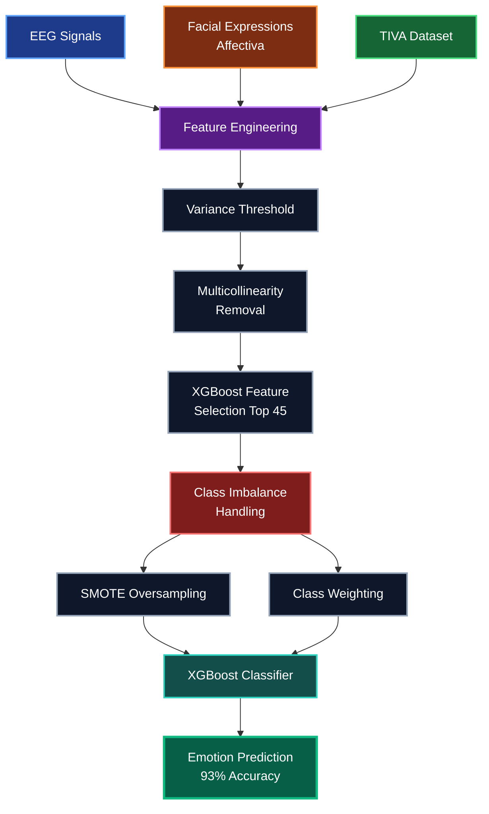
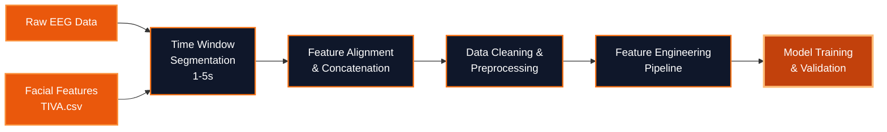

# 🧠 Emotion Classification using Facial Expressions and EEG

[](https://python.org)
[](https://xgboost.readthedocs.io/)
[](#results)
[](LICENSE)

> **Advanced multimodal emotion recognition system combining EEG brainwave patterns with facial expression analysis to achieve 93% classification accuracy.**

## 🎯 Project Overview

This project tackles the challenging problem of emotion classification by fusing two powerful modalities:
- **EEG signals**: Capturing neural activity and brainwave patterns
- **Facial expressions**: Analyzing micro-expressions and facial features via Affectiva

**Key Achievement**: 93% classification accuracy using advanced feature engineering and XGBoost modeling.

## 🏗️ System Architecture



## 📊 Data Pipeline



## 🚀 Key Features

### 🔧 Advanced Feature Engineering
- **Variance Threshold Filtering**: Removes low-variance features
- **Multicollinearity Detection**: Eliminates redundant features
- **XGBoost Feature Importance**: Selects top 45 most predictive features
- **Time-Window Alignment**: Synchronized EEG and facial expression data

### ⚖️ Class Imbalance Solutions
- **SMOTE Oversampling**: Generates synthetic samples for minority classes
- **Class Weighting**: Adjusts loss function for balanced learning
- **Strategic Undersampling**: Manages dominant emotion classes

### 🎯 Model Performance
- **Algorithm**: XGBoost Classifier
- **Accuracy**: 93%
- **Multimodal Fusion**: EEG + Facial Expression features

## 📈 Results

| Metric | Score |
|--------|-------|
| **Accuracy** | **93%** |
| **Model** | XGBoost Classifier |
| **Features** | 45 (optimized) |
| **Data Modalities** | EEG + Facial Expressions |


## 📁 Project Structure

```
emotion-classification/
├── data/
│   ├── EEG.csv              # EEG brainwave features
│   └── TIVA.csv             # Facial expression data
├──  notebooks/
│   ├── 01_preprocessing.ipynb       # Data cleaning & preprocessing
│   ├── 02_feature_engineering.ipynb  # Feature importance & selection
│   └──  03_modeling_baseline.ipynb              # XGBoost classifier
└── README.md 
```

## 🔍 Methodology

### 1. Data Preparation
- **Time-window segmentation** (1-5 second windows)
- **Feature alignment** between EEG and facial expression data
- **Label assignment** based on dominant emotion per window

### 2. Feature Engineering Pipeline
- Variance threshold filtering
- Multicollinearity removal
- XGBoost-based feature importance ranking
- Top 45 feature selection

### 3. Class Imbalance Handling
- SMOTE oversampling for minority emotions
- Class weight adjustment in loss function
- Strategic undersampling of dominant classes

### 4. Model Training
- XGBoost classifier with optimized hyperparameters
- Cross-validation for robust performance estimation
- Feature importance analysis for interpretability

## 📊 Emotion Classes

The system classifies the following emotional states:
- **Engaged** 🎯
- **Confused** 🤔  
- **Neutral** 😐
-
